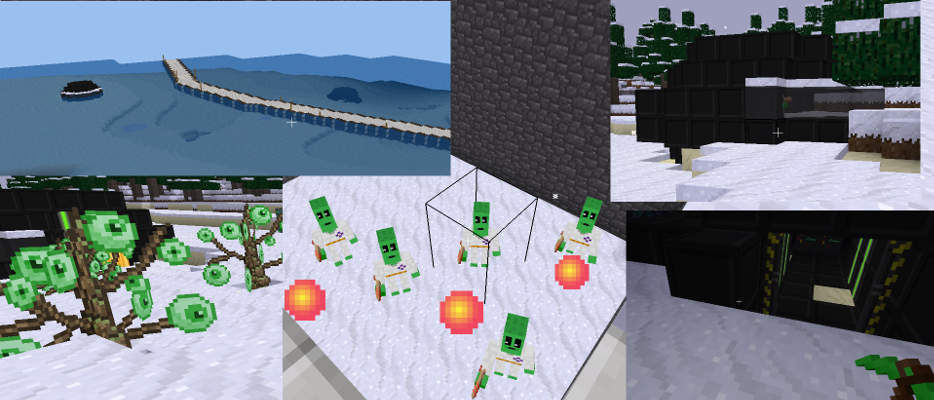
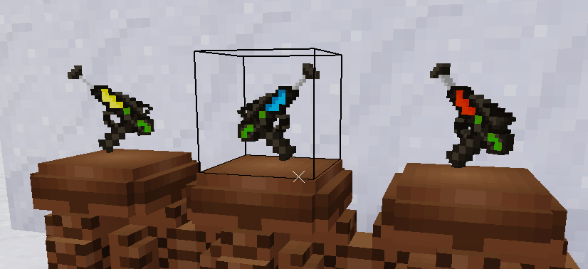

# ufowreck
> UFO wreck mod for Minetest by Irremann

Used textures "scifi_nodes" and "amcaw" mods. Warning: there may be conflicts, do not use them together.
Teleport gun based on "point teleporter" mod by Wuzzy.

Invasion! Many crashed UFOs on the ground. Inside the UFOs are aliens, strange plants, devices and boxes.

But be careful! Somewhere in the hull is hidden a cloning unit that creates armed crew members. They call themselves "floob" and attack all living things around them without hesitation.

Our researchers also report that electrical devices from UFOs operate at high voltage. This can be useful!

## License
GNU GPL 3.0
